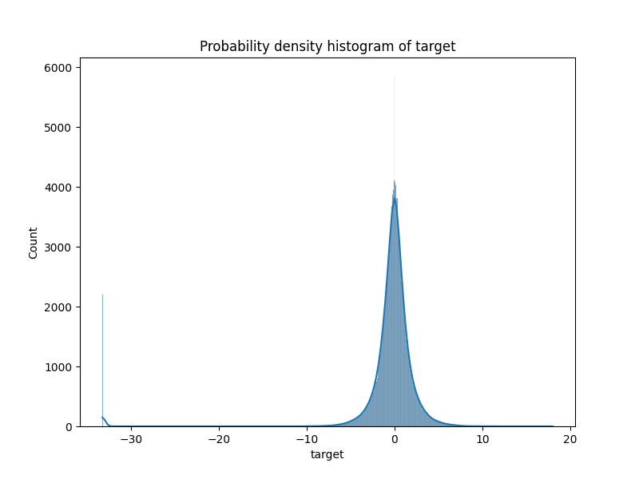
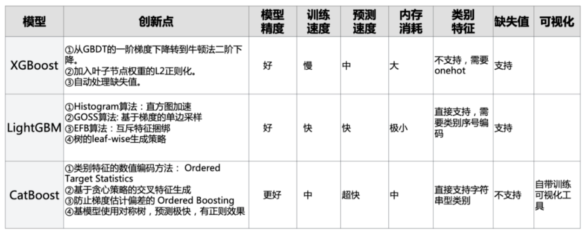
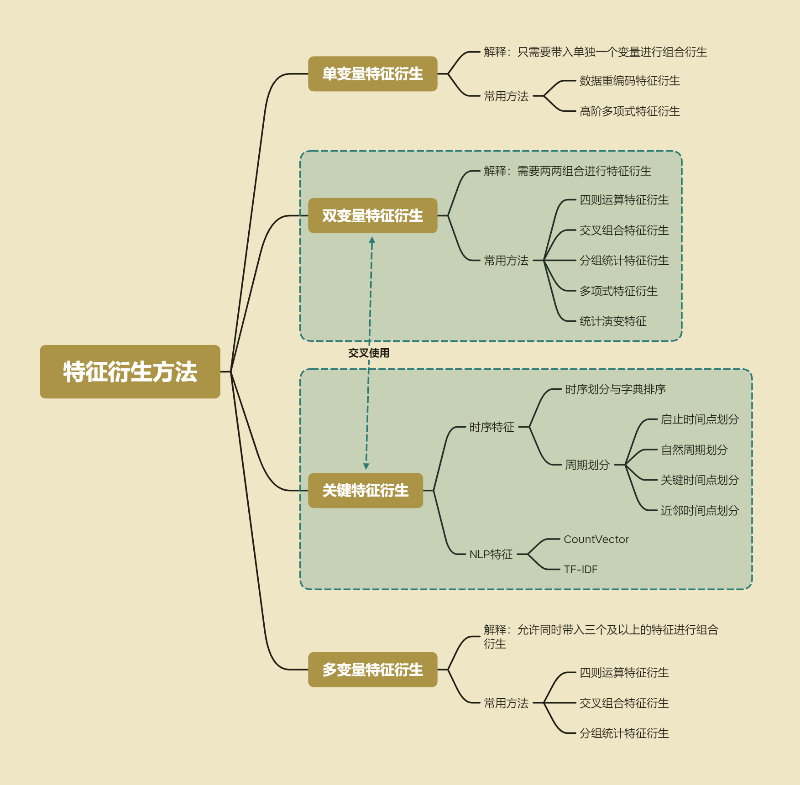

### 业务目标：更好的进行本地服务推荐
  在官方给出的说明中，我们不难发现，Elo使用机器学习算法技术的核心目的，是为了更
好的在App内为用户推荐当地吃穿住行的商家服务，包括热门餐厅展示、优惠折扣提醒等 。也就是说，其根本目的是为了推荐，或者说为每个
用户进行更加个性化的推荐，也就是赛题标题中的所写的：Merchant Category
Recommendation（商户类别推荐），比赛链接：https://www.kaggle.com/competitions/elo-merchant-category-recommendation

### 算法目标：用户忠诚度评分预测
  所谓用户忠诚度评分，通过后续查看Evaluation不难发现，其实就是对每个用户的评分进行预测，本质上是个回归问题。


### 数据介绍
原始数据可以直接通过上面的链接获取，原始数据大约3GB大小。
- Data_Dictionary.xlsx：数据目录，包含每个数据文件的字段含义的介绍（包含匿名字段）<br />
- sample_submission.csv：比赛提交实例<br />
- train.csv：训练集<br />
- test.csv：测试集<br />
- merchants.csv：商户数据<br />
- historical_transactions.csv：信用卡交易记录数据集，交易数据量接近2000万<br />
- new_merchant_transactions.csv：与historical_transactions一样，只是记录了不同时间区间的信用卡消费情况。<br />


### 预测目标值分布情况



### 创建虚拟环境
```bash
conda create -n lightgbm python=3.8
conda activate lightgbm
```

### 安装项目所需第三包
```bash
pip install -r requirements.txt
```

### 分别运行每一个py文件
data_exploration(1.0).py:数据分布探索，数据规律一致性分析<br />

data_exploration(1.1).py:训练测试数据预处理<br />

data_exploration(1.2).py:商户数据和交易数据的数据探索与数据清洗：方案一 在合并的过程中：对缺失值进行-1填补，然后将所有离散型字段化为字符串类型（为了后续字典合并做准备）<br />

data_exploration(1.3).py:商户数据和交易数据的数据探索与数据清洗：方案二 在合并的过程中：新增两列，分别是purchase_day_diff和purchase_month_diff，其数据为交易数据以card_id进行groupby并最终提取出purchase_day/month并进行差分的结果。<br />

feature_engineering(2.1).py:基于transaction数据集创建通用组合特征<br />

feature_engineering(2.2).py:基于transaction数据集创建业务统计特征创建<br />

data_merge(2.3).py:对不同方式衍生出来的特征做拼接<br />

random_forest(2.4).py:用随机森林跑baseline<br />

Filter_RF_GridSearchCV(3).py:相关系数选择top300特征，随机森林建模+网格搜索超参数优化（巨耗时）

Wrapper_Lightgbm_TPE(4.1).py：用lightgbm模型的feature_importance筛选top300特征，lightgbm建模+贝叶斯超参数优化

nlp_xgboost_bayes(4.2).py：在数据集中存在大量的ID相关的列（除了card_id外），可以考虑采用NLP中CountVector和TF-IDF两种方法来进行进一步特征衍生，其中CountVector可以挖掘类似某用户钟爱某商铺的信息，

nlp_xgboost_bayes(4.3).py：xgboost建模+贝叶斯产参数优化（耗时较久）

Voting(4.4).py：考虑对random_forest、lightgbm、xgboost做Voting模型融合，如平均融合，加权融合等

Stacking(4.5).py：考虑对random_forest、lightgbm、xgboost做Stacking模型融合

feature_optimization(5.1).py：进一步更加精细化地挖掘特征，并增加target离群值标记特征，1.针对业务字段含义进一步做手动特征衍生，2.进一步挖掘交易数据的时序特征，3对部分特征考虑二阶交叉特征衍生

LightGBM_XGBoost_CatBoost(5.2).py：用优化后的特征，分别跑lightgbm、xgboost、catboost模型(5折交叉验证)

LightGBM_XGBoost_CatBoost_Voting(5.3).py：用优化后的特征，分别跑lightgbm、xgboost、catboost的结果做Voting模型融合

LightGBM_XGBoost_CatBoost_Stacking(5.4).py：用优化后的特征，分别跑lightgbm、xgboost、catboostStacking模型融合，并考虑二阶段建模：增加一个分类器判断用户是否异常，针对异常的用户输出特定的值

### 总结
1.关于上面所使用到模型：Random_Forest、LightGBM、XGBoost、CatBoost。<br />
  其中Random_Forest预测效果最差，并且内存和时间较久，尤其是Random_Forest + GridSearchCV简直就是灾难……

2.模型LightGBM、XGBoost、CatBoost对比：

  由上图可以看出LightGBM模型不仅预测效果好，而且速度快、占内存小。比较适合用来搭建baseline

3.关于超参数优化
- 常用的产参数优化工具有sklearn.model_selection自带的：网格搜索、对半网格搜索、随机搜索。
- hyperopt中的贝叶斯优化(tpe)
- 其他，如遗传算法（产参数进化） 

推荐使用贝叶斯优化，相对来说又快又准。

4.常用的特征衍生方法：




